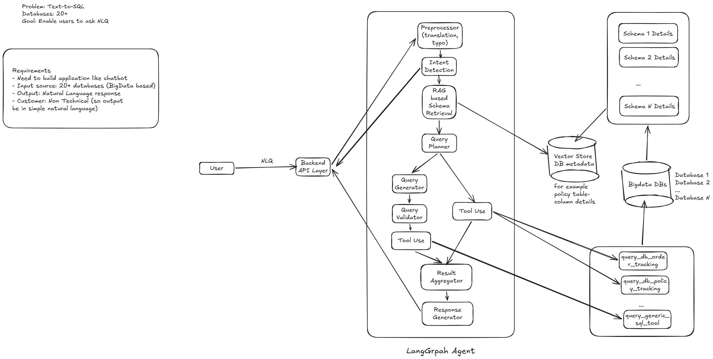

# 🤖 ChatDB - Multi-Agent Text-to-SQL System

**Author: Shilpa Rana**

[](https://opensource.org/licenses/MIT)
[](https://www.python.org/downloads/)
[](https://www.docker.com/)

A sophisticated multi-agent system that converts natural language queries into SQL/MongoDB queries across 20+ databases using LangGraph orchestration.

## 🏗️ Architecture Overview



## 🏗️ Architecture

```
              User Query
                  ↓
        PreprocessingAgent
                  ↓
      IntentClassifierAgent
                  ↓
      DatabaseSelectorAgent
                  ↓
      SchemaRetrieverAgent
                  ↓
      QueryGeneratorAgent
                  ↓
        ExecutionAgent
                  ↓
    ResponseFormatterAgent
```

## ✨ Features

- 🧠 **7 Specialized Agents**: Preprocessing, Intent Classification, Database Selection, Schema Retrieval, Query Generation, Execution, Response Formatting
- 🌍 **Multi-Language Support**: Detects and translates queries, returns responses in original language
- 🗄️ **20+ Databases**: PostgreSQL, MySQL, MariaDB, MongoDB with real-world schemas
- 🔍 **Vector Schema Search**: Intelligent database selection using semantic matching
- 📊 **LangSmith Tracing**: Complete workflow observability
- 🐳 **Docker Ready**: Multi-database setup with one command

## 🚀 Quick Start

### Prerequisites

- Python 3.8+
- Docker & Docker Compose
- **Azure OpenAI API key** (Required - system will not work without it)

### Installation

**1. Clone the repository**
```bash
git clone https://github.com/shilparana/chat_db.git
cd chat_db
```

### 2. Create virtual environment
```bash
python -m venv .venv
source .venv/bin/activate  # Linux/Mac
# or
.venv\Scripts\Activate.ps1  # Windows
```

### 3. Install dependencies
```bash
pip install -r requirements.txt
```

### 4. Configure environment
```bash
cp .env.example .env
# Edit .env with your Azure OpenAI API key (REQUIRED)
# The system will not function without a valid API key
```

### 5. Start databases
```bash
docker-compose up -d
```

### 6. Run the chatbot
```bash
python chatbot.py
```

## � Usage Examples

### Database Queries
```bash
"who is the highest earning employee"
"show me top 5 products by sales"
"how many customers are in the CRM"
"list all orders from last month"
```

### Multi-Language Support
```bash
"¿quién es el empleado con mayor salario?"  # Spanish
"कितने कर्मचारी हैं?"                      # Hindi
"combien d'employés avons-nous?"            # French
```

### Chatbot Commands

| Command | Description |
|---------|-------------|
| Type your question | Ask anything about the databases |
| `/help` | Show help message |
| `/databases` | List all available databases |
| `/stats` | Show session statistics |
| `/clear` | Clear screen |
| `/exit` | Exit chatbot |

## 🗂️ Supported Databases

### PostgreSQL (5 databases)
- **postgres-ecommerce** - Products, orders, customers
- **postgres-finance** - Accounts, transactions, loans
- **postgres-healthcare** - Patients, doctors, appointments
- **postgres-logistics** - Warehouses, shipments, deliveries
- **postgres-hr** - Employees, attendance, payroll

### MySQL (5 databases)
- **mysql-crm** - Contacts, companies, opportunities
- **mysql-inventory** - Items, suppliers, purchase orders
- **mysql-sales** - Orders, customers, sales reps
- **mysql-marketing** - Campaigns, subscribers, analytics
- **mysql-support** - Tickets, agents, knowledge base

### MariaDB (5 databases)
- **mariadb-education** - Students, courses, assignments
- **mariadb-gaming** - Players, characters, quests
- **mariadb-travel** - Bookings, hotels, flights
- **mariadb-realestate** - Properties, agents, transactions
- **mariadb-events** - Venues, registrations, speakers

### MongoDB (5 databases)
- **mongodb-analytics** - User sessions, events, conversions
- **mongodb-logs** - Application, error, audit logs
- **mongodb-social** - Posts, comments, users
- **mongodb-iot** - Devices, sensor readings, alerts
- **mongodb-content** - Articles, authors, media

## ⚙️ Configuration

### Azure OpenAI (Primary LLM)

Edit `.env` file:
```env
AZURE_OPENAI_API_KEY=your_api_key_here
AZURE_OPENAI_ENDPOINT=https://your-endpoint.openai.azure.com/
AZURE_OPENAI_DEPLOYMENT=gpt-4o-mini
```

**Benefits:**
- ✅ Best quality responses
- ✅ Fastest performance
- ✅ Cloud-based (works anywhere)

**Note:** Azure OpenAI credentials are required for the chatbot to function.

## 🧪 Testing

```bash
# Run all tests
python -m pytest tests/

# Test specific agent
python tests/test_hr_queries.py

# Test multilingual support
python tests/test_multilingual.py
```

## 🔧 Troubleshooting

### "Virtual environment not found"

**Solution:** Run `setup.bat` again

### "Docker not running"

**Solution:** Start Docker Desktop, then run `chatbot.bat`

### "API connection failed"

**Solution:** 
1. Make sure `chatbot.bat` is running
2. Wait for "Uvicorn running on http://0.0.0.0:8001"
3. Try your query again

### "No LLM available"

**Solution:** Add valid Azure OpenAI credentials to `.env` file

### Slow responses

**Normal for:**
- First query (cold start)
- Complex multi-database queries
- Large result sets

**Check performance metrics** shown after each query

## 📈 Performance

### Simple Queries
- **Execution time:** 2-4 seconds
- **Databases queried:** 1
- **Concurrent:** No

### Complex Queries
- **Execution time:** 3-6 seconds
- **Databases queried:** 2-5
- **Concurrent:** Yes (parallel execution)

### Performance

- **Speed:** Very Fast (1-2s per query)
- **Quality:** Excellent with GPT-4o-mini
| Cost | Pay per token | Free |
| Offline | No | Yes |

## �️ Agent Details

### 1. PreprocessingAgent
- Language detection & translation
- Typo correction
- Query normalization

### 2. IntentClassifierAgent
- Classifies: database_query, casual_conversation, off_topic
- Uses vector search for context
- Confidence scoring

### 3. DatabaseSelectorAgent
- Analyzes query complexity
- Selects relevant databases
- Determines join requirements

### 4. SchemaRetrieverAgent
- Fetches database schemas
- Provides table/column information

### 5. QueryGeneratorAgent
- Generates SQL/MongoDB queries
- Validates query safety
- Optimizes for performance

### 6. ExecutionAgent
- Executes queries across databases
- Handles errors gracefully
- Collects results

### 7. ResponseFormatterAgent
- Formats results naturally
- Translates back to original language
- Handles edge cases

## 📁 Project Structure

```
db_chat/
├── setup.bat              # One-time setup (run first)
├── chatbot.bat            # Start chatbot (run this)
├── README.md              # This file
├── .env                   # Configuration
├── app/                   # Application code
│   ├── main.py           # FastAPI server
│   ├── llm_manager.py    # Azure OpenAI manager
│   ├── vector_store.py   # Schema vector search
│   ├── agent/            # Query processing
│   └── database/         # Database connectors
├── scripts/              # Utility scripts
├── init-scripts/         # Database initialization
└── docker-compose.yml    # Database configuration
```

## 🔐 Security

### API Keys
- Store in `.env` file (never commit to git)
- `.env` is in `.gitignore` by default

### Database Access
- Databases run in Docker containers
- Default credentials in `docker-compose.yml`
- Change passwords for production use

### Security
- Azure OpenAI uses enterprise-grade security
- Credentials stored in `.env` file (not committed to git)
- Database connections use standard authentication

## 🆘 Getting Help

### Check Status
Visit: http://localhost:8001/health

Shows:
- API status
- Number of databases
- Azure OpenAI connection status

### View API Documentation
Visit: http://localhost:8001/docs

Interactive API documentation with:
- All endpoints
- Request/response examples
- Try it out feature

### Common Issues

**Q: Is Azure OpenAI required?**  
A: Yes, valid Azure OpenAI credentials are required.

**Q: How much does it cost?**  
A: Azure OpenAI charges per token (typically $0.001-0.002 per 1K tokens).

**Q: Can I add more databases?**  
A: Yes! Edit `docker-compose.yml` and add your database.

**Q: Does it work on Mac/Linux?**  
A: The app works, but `.bat` files are Windows-only. Use equivalent shell commands.

**Q: Can I deploy this?**  
A: Yes! It's a standard FastAPI app. Deploy to any cloud platform.

## 🎓 Advanced Usage

### Direct API Access

```bash
# Health check
curl http://localhost:8001/health

# List databases
curl http://localhost:8001/databases

# Query
curl -X POST http://localhost:8001/query \
  -H "Content-Type: application/json" \
  -d '{"question": "What are the top products?"}'
```

### Environment Variables

All settings in `.env`:
```env
# Azure OpenAI
AZURE_OPENAI_API_KEY=
AZURE_OPENAI_ENDPOINT=
AZURE_OPENAI_DEPLOYMENT=
AZURE_OPENAI_API_VERSION=

# Optional
LANGCHAIN_TRACING_V2=false
LOG_LEVEL=INFO
```

## 📊 Session Statistics

The chatbot tracks:
- Number of queries
- Simple vs complex queries
- Total execution time
- Average query time

View with `/stats` command in chatbot.

## 🤝 Contributing

1. Fork the repository
2. Create feature branch (`git checkout -b feature/amazing-feature`)
3. Commit changes (`git commit -m 'Add amazing feature'`)
4. Push to branch (`git push origin feature/amazing-feature`)
5. Open Pull Request

## 📄 License

This project is licensed under the MIT License - see the [LICENSE](LICENSE) file for details.

## 🙏 Acknowledgments

- **Developed by**: Shilpa Rana
- [LangGraph](https://github.com/langchain-ai/langgraph) for multi-agent orchestration
- [LangChain](https://github.com/langchain-ai/langchain) for LLM integration
- [Azure OpenAI](https://azure.microsoft.com/en-us/services/openai-service/) for LLM services
- [LangSmith](https://smith.langchain.com/) for observability

## 📞 Support

- 📧 Email: shilparana88@gmail.com
- 🐛 Issues: [GitHub Issues](https://github.com/shilparana/chat_db/issues)
- 💬 Discussions: [GitHub Discussions](https://github.com/shilparana/chat_db/discussions)
